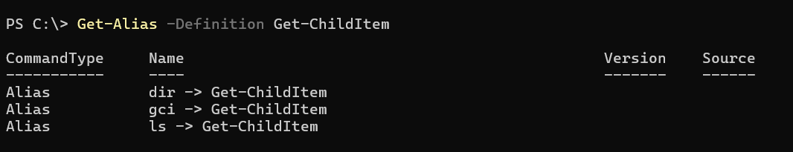
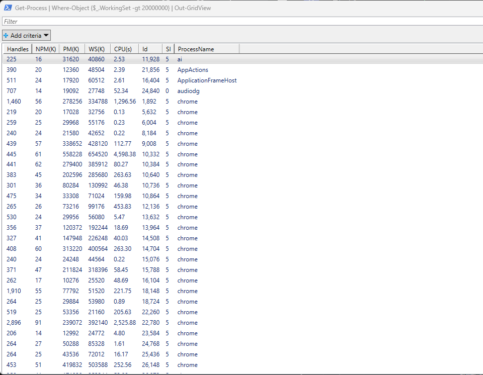

# Notes and Cheatsheet of PowerShell commands

## PowerShell Common cmdlet verbs.

| Cmdlet Verb | Definition |
|-----|-----|
| Get | to GET something |
| Start | to RUN something |
| Out | to OUTput something |
| Stop | to STOP something that's already running |
| Set | to DEFINE something e.g. a variable |
| New | to CREATE something |

`Get-Help` - Displays help about Windows PowerShell cmdlets and concepts.

`Get-Help Get-Help` - Syntax of how to use the *Get-Help* cmdlet.

`Get-Help Get-Help -Full` - Use the *Flag -Full*.

`Get-Alias` - Shows the PowerShell and other CLI languages alternative commands to achieve similar results.

`Get-Alias -Definition Get-ChildItem` - Use the *-Definition flag* to get all the possible alternatives of the **Get-ChildItem** cmdlet.

`Get-Command` - Discover and list all available commands installed on your computer.

`Get-Command *network*` - List all commands that are network related.

`Get-Service` - Retrieve a list of all *running and stopped* processes in your computer.

## File Travesal

`Get-ChildItem` - Retrieve a list of all files and child-directories (items and child items) including the current user's permissions, last-write-time and the length (size of a file) in the current directory/location.

`cd .\myfolder\` - Move into the myfolder directory.

`ls` - List chid items in current working directory.

**NOTE:** Absolute vs Relative paths.

`type .\MyDocument.txt` - Display contents of the *MyDocument.txt* file on the terminal. (Similar to **cat** and **Get-Content**)

`Move-Item .\MyDocument.txt C:\MyTests\Folder1` - Move the *MyDocument.txt* file to *Folder1* saved in *C:\MyTests* (Similar to **mv**)

`cd ..\..` - Move back two directory levels.

`Copy-Item *.txt C:\MyTests\Folder2` - Move all the *.txt* files in current working directory to the folder2 directory. (**cp** in Linux)

`Remove-Item *.txt` - Delete all the *.txt* files from current working directory. (**rm** in Linux)

`mkdir Folder3` - Make directory named *folder3*.

`Remove-Item -Path "C:\MyTests\Folder3" -Recurse -Force` - Delete a non-empty directory silently.

`Remove-Item -Path "C:\MyTests\Folder3\*" -Recurse -Force` - Delete only the contents inside a folder (keeping the root folder).

**NOTE:** *-Force* Allows you to delete hidden or read-only files that would otherwise trigger an access error.

`Remove-Item -Path "C:\MyTests\Folder3" -Recurse -WhatIf` - Test what will be deleted (without actually deleting anything)

`Push-Location` - Maker that you can use to set a pre-defined return location.

`Pop-Location` - Used to return to the *Push-Location* position.

## PowerShell Variables 

`Get-Variable` - List all variables in current powershell session / installed on computer.

`Set-Variable -Name Test -Value "Hello World!"` - Create a variable named *Test* whose value is *Hello World!*

`$Test` - Retrieve value of *Test* variable and display on screen i.e. **Hello World!"**

`$Test = "Goodbye World!"` - Change value stored in the *Test* variable to *Goodbye World*.

`$Test - "10"`, `$Test +2` - Will get *102* since 10 is treated as a string due to the quotation marks.

`$Test = 10; $Test += 2` - Define the value of the variable $Test to be the int 10 then add a second command to add 2 to the value stored in $Test. 

**NOTE:** Use the **(;)** separator to run multiple commands in one line.

`$DateTime = Get-Date` - Assign the current date & time to the variable.

`${Date Time} = "Not recommended"` - You have the option of having variables with special characters like spaces when you use {}.

`$DateTime.Hour` - Retrieve the Hour value from date.

`$DateTime.Day` - Retrieve the Date value from date.

`$a,$b,$c = 100` - Assign multiple variables the same value of 100.

`$a,$b,$c = "red",10,true"` - Assign different values to each variable in order.

## PowerShell Objects

`Get-Process` - Retrieves a list of all active processes running.

`Get-Process | Sort-Object ProcessName` - Retrieves a list of all active processes running and pipes to sort the results alphabetically by the ProcessName field.

`Get-Process | Where-Object {$_.CPU -gt 50}` - Retrieves a list of all active processes running but filter only those whose CPU field *($_.CPU)* is greater *(-gt)* than 50.

### Arrays & Hash Tables

`$Menu = @("Dinner", "Drinks", "Appetizers")` - Create an array.

`$hashserver = @{"server1" = "192.168.17.21"; "server2" = "192.168.17.22"; "server3" = "192.168.17.23"}` - Create a hash table (Key-Value pairs).

`$hashserver.Add("server4", "192.168.17.24")` - Add another entry to the hash table.

`$hashserver.Set_Item("server4", "192.168.200.20")` - Change the value of *server 4*.

`$ObjServer = [PsCustomObject] @{"server1" = "192.168.17.21"; "server2" = "192.168.17.22"; "server3" = "192.168.17.23"}` - Display in different (tabluar) format.

`$ObjServer.server1` OR `$hashserver.server1` - Display the value of server1.

## Script Analysis

In this section, we are going to investigate what caused a process to launch.

**CIM cmdlets** are modern, secure, and cross-platform, whereas **WMI cmdlets** are legacy, deprecated, and restricted to Windows systems. Both frameworks query the exact same data repository on a Windows machine, but they use completely different underlying network protocols and serialization methods to talk to remote machines.

| Feature | CIM Cmdlets (*e.g., Get-CimInstance*) | WMI Cmdlets (*e.g., Get-WmiObject*) |
|-----|-----|-----|
| Status | Modern standard (Recommended) | Legacy / Deprecated |
| Primary Protocol | WS-Management (WS-MAN via WinRM) | DCOM / RPC |
| Firewall Profile | Highly friendly (Single port HTTP/HTTPS) | Difficult (Requires large random port ranges) |
| Cross-Platform | Yes (Windows, Linux, macOS) | No (Windows only) |
| PowerShell Core (6+) | Fully supported | Removed / Unsupported |
| Tab Completion | Supported for classes and namespaces | Not supported |

`Get-CimInstance -ClassName Win32_Process` - Similar to **Get-Process**.

`Get-CimInstance -ClassName Win32_Process -Filter "ProcessId=1234"` - Retrieve process with the PID 1234.

## Filtering and Formatting

### Filtering

`Get-Process | Where-Object -Property Name -eq 'Notepad'` - Get the process where the name equals notepad.

`Get-Process | Where Name -eq 'Notepad'` - - Get the process where the name equals notepad.

`Get-Process | ? Name -eq 'Notepad'` - Get the process where the name equals notepad.

**NOTE:** Good practise in PowerShell, Filter left, format right. E.g.

`Get-Service | Where-Object -FilterScript {$_.Status -eq 'Running' -and $_.Name -like 'Win*'}` - Get a service that is *running* and whose name starts with *Win*.

**NOTE:** *A process* is an instance of a running program (like Chrome or Word) that usually has a visible window and requires an active user session. *A service* is a specialized background process that performs system functions, runs automatically before you log in, and continues operating independently of any user account.

`Get-Service -Name 'Win*' | Where-Object -FilterScript {$_.Status -eq 'Running'}` - Difference between this command and the preceding one is that this is faster because you take the compute intensive filtering at the top of the queue then pipe down a few entries to find the *running* commands instead of the whole services list.

`Measure-Command{Get-Service | Where-Object -FilterScript {$_.Status -eq 'Running' -and $_.Name -like 'Win*'}} | Select TotalSeconds` - Measure the time it takes to run the specified command.

### Select-Object

`Get-Process | Select-Object -Property ProcessName, Id, WS` - The output will only have the fields; *ProcessName, Id, WS*. WS = Working Set.

`Get-Process | Select-Object -Last 5` - Select last 5 processes.

`Get-Service | Where-Object -FilterScript {$_.Status -eq 'Stopped' -and &_.StartType -eq 'Automatic'} | Select-Object Name, Status, StartType` - Retrieve the services that are currently *stopped* and have an *automatic* start type. The output table should only have the fields: *Name, Status, StartType*.

### Format List

`Get-Service | Format-List` OR `Get-Service | FL`

`Get-Service | FL -Property *` - Retrieve a little bit more information than the default.

`Get-Process | Sort-Object -Property BasePrority` - Sort in a csv / table.

`Get-Process | Sort-Object -Property BasePrority | FT -GroupBy BasePriority -Wrap` - Retrieve the processes sorted and grouped by Base Priority. Wrap ensures the output is not truncated.

### Out Grid View

Best for GUI.

`Get-Process | Where-Object {$_.WorkingSet -gt 20000000} | Out-GridView` - Shows UI for processes whose WS > 20000000. The pane has a search box.

`Get-Process | Where-Object {$_.WorkingSet -gt 20000000} | Out-GridView -Title "Get-Process" -PassThru | Export-Csv -Path C:\Users\Hp\Desktop\GetProcess.csv` - Allows you to select particular process names (Ctrl + Left Click) and saves the result in a csv file.

## Loops and Conditions

|Operator|Description|
|-----|-----|
| -gt | Greater Than |
| -lt  | Less Than |
| -ne | Not Equal To |

`10 -gt 2` - True

`10 -lt 2` - False

`"Hello World".contains("Hello")` - True

`"Hello World" -like "H*"` - True

<!-- for(int;condition;repetition){} -->

